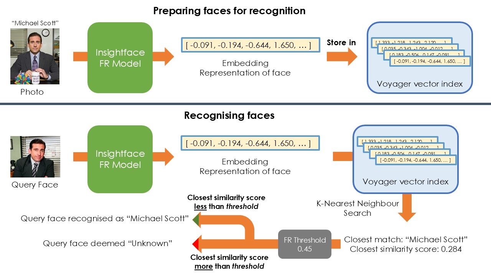
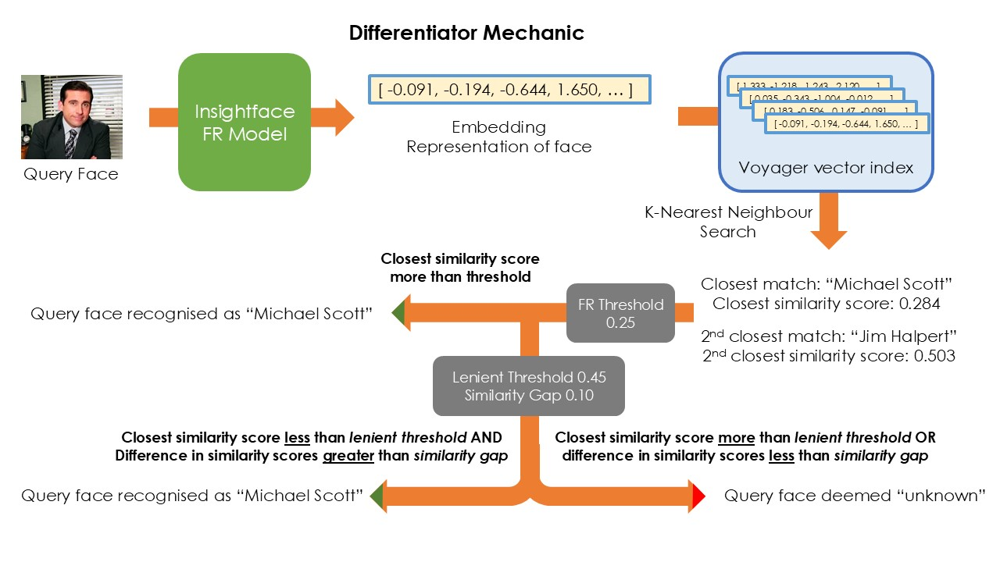
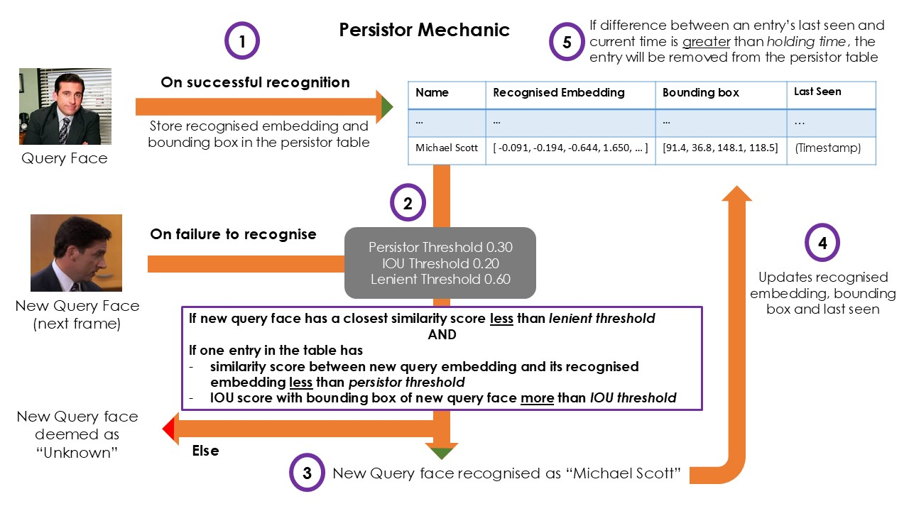

# Developer's Guide for SimpliFRy

> This file provides more detailed information about how simpliFRY's facial recognition algorithm works, what new features are added and how developer can use simpliFRy.

## Table of Contents

- [FR Algorithm](#fr-algorithm)
- [New Features](#new-features)
    1. [Enhanced Detection Algorithm](#enhanced-detection-algorithm)
    2. [Microservice Design](#microservice-design)
- [FR Settings](#fr-settings)
- [API Endpoints](#api-endpoints)

---

## FR Algorithm



SimpliFRy's facial recognition algorithm works as follows:

1. A database of face pictures is analysed by the insightface model, their embeddings produced and loaded into the voyager vector index
2. An query image is passed to the insightface model, which detects the image for human faces and represents them as an <ins>embedding</ins> (a list of numbers). Let us call these faces 'query faces' and their respective embeddings 'query embeddings'.
3. A K-Nearest Neighbour search is conducted on each of those query embeddings using voyager, a vector index that is loaded with the embedding representation of a database of faces.
4. The closest embedding is found, and its <ins>similarity score</ins> with the query embedding is retrieved (**the similarity metric used is cosine similarity, so the lower the number, the closer the match**).
5. If the closest similarity score is <ins>above</ins> a given threshold (cosine distance further than threshold), the face from which the query embedding is derived (query face) is considered an <ins>unknown face</ins>. If the score is <ins>below</ins> the threshold, the query face will be labelled as the <ins>person whose face produced the closest matching embedding</ins>.

---

## New Features

### Enhanced Detection Algorithm

_How do we increase the detection rate, while also minimising false positives?_

This was a key concern in previous iterations of the FRS. Set the similarity threshold too strict and most faces would be labelled as 'unknown' most of the time; set it too lenient and some faces might be wrongly labelled as another person. The former does not make a good showcase to an audience (who would be impressed by a facial recognition software that labels everyone as ) What a frustrating conundrum!

An astute observer might encourage programmers to 'adjust the FR model used' to better suit our cases. Unfortunately, novice programmers like myself with little understanding of the mathematics behind deep neural network do not fancy our chances of actually improving the model should we dive in head on.

Returning to the key question of this section, I added 2 small modifications to the algorithm. Hopefully, that addresses the concern to a reasonable degree of success. But before I dive into these 2 modifications, let us first take a look at how the FR algorithm works.

#### Modification 1: Differentiator

The differentiator mechanic was conceived from 3 observations.

1. A sufficiently low (strict) threshold that eliminates almost all false positives will result in a less than ideal detection rate.
2. False detections (incorrectly labelling a person as someone else) generally occurs when the closest similarity score of the wrong face is marginally lower than that of the correct face, and this tends to occur only with lenient (high) score.
3. When the FR Algorithm fails to pick up someone whose face is in its database, there is a good chance that the face it should have picked up (correct individual) has a much lower closest similarity score (closer match) than the next closest face (someone else). This is especially true for smaller datasets of faces.

These provide 2 implications.

1. The first 2 observations imply that when the 2 closest similarity scores have a small difference, it is preferable to have a _stricter_ threshold.
2. Observations 1 and 3 imply that when the closest embeddings is significantly more similar to the query embedding than the next closest embedding (large difference in 2 closest similarity scores), it is preferable to have a _more lenient_ threshold.

The differentiator mechanic does exactly that. Instead of just fetching the closest embedding in step 4, it retrieves the 2 closest embeddings and their similarity scores. It then compares their similarity scores. If the <ins>difference in similarity scores</ins> of the 2 closest embedding is greater than a **_Similarity Gap_**, a **_Lenient Threshold_** will be used. If the difference is less than the similarity gap, the original, stricter threshold will be used.

In effect, this mechanic allows the FR algorithm to detect faces it otherwise fails to capture if a clear favourite stands out.



#### Modification 2: Persistor

The persistor mechanic came about from this one observation.

1. If an individual gets detected correctly while facing one angle, a small movement (commonly a slight rotation of his/her head) may result in a bad angle and thus having his face re-labelled as 'unknown'. This is in spite of the individual remaining at pretty much the same spot in the video.

As the insightface algorithm creates facial embeddings from facial features, angle of a face with respect to the camera is a significant factor. Some angles that hide certain features could alter the embeddings to a large enough degree that their similarity scores with the database embedding no longer meet a certain threshold.

The persistor mechanic comes into play by making use of the following:

1. The individual's face was previously detected by the FR algorithm
2. From one frame to the next, the embedding representation of an individual's face will not change significantly.
3. From one frame to the next, the position of an individual's face will not change significantly.

Therefore, the mechanic works as follows:

1. Upon successful detection of an individual, the his/her query embeddings are updated and maintained in a dictionary for up to the duration of the **_Holding Time_**.
2. If a query face fails to be detected, its embedding will be compared to those stored in the dictionary. To consider the face as 'detected', it must fulfil 3 conditions: the position of the query face and that of the face in the persistor dictionary must be in roughly the same position (**_IOU Threshold_**) **AND** the similarity, as measured using cosine distance, between query embedding and the embedding in the persistor dictionary (which are previous query embeddings) must below **_Persistor Threshold_** (which is very strict) **AND** the query embedding's similarity score with the corresponding embedding in the database must meet a separate **_Lenient Threshold_** (different from the Lenient Threshold of the differentiator).
3. Should the query face be detected as a result of the persistor mechanic, its query embedding will be updated in the dictionary and replace the previous query embedding.



Notes

- The position checker in this mechanic currently uses Intersection-Over-Union (IOU). This might not be the best way to do so and a more conventional tracking algorithm such as DeepSORT could be used instead.
- The persistor mechanic might not be very useful or reliable, you can turn it off in the [settings page](#fr-settings).

### Microservice Design

While fully operational as an independent software, simpliFRy can also be used as a microservice as part of a larger software. The UI for simpliFRy is lightweight, built using <ins>HTML/CSS/JS</ins> and contains only the most essential features.

Instead, here are a list of API endpoints that frontend services and other backend services can use to interact with the simpliFRy app.

| Endpoint      | Method | Description                              |
| ------------- | :----: | ---------------------------------------- |
| `/start`      |  POST  | Start video broadcast and FR inferencing |
| `/end`        |  POST  | Ends video broadcast and FR inferencing  |
| `/checkAlive` |  GET   | Check if FR has started                  |
| `/vidFeed`    |  GET   | Access video feed of camera              |
| `/frResults`  |  GET   | Access FR Results                        |
| `/submit`     |  POST  | Change FR [settings](#fr-settings)       |

Hopefully, this makes simpliFRy far more versatile as other simple highly-specialised apps can be created to interact with it depending on the requirements of the user. (It is also because it takes too much work to build an app with a lot of customisable features.)

---

## FR Settings

SimpliFRy's facial recognition algorithm has a few parameters that can be adjusted to change the detection rate. This section will explain what each of them does.

You can tweak these settings by submitting the form in the `/submit` endpoint. 

#### FR Threshold

**Facial Recognition Threshold** is the maximum distance between 2 embeddings for them to be close enough to be considered as representations of the same face.

The closest similarity score of a query embedding (or face) is compared against this number. If the score is greater than this number, it means that the query face is unknown (distance too large). If the score is smaller, the face will be recognised.

- **Settings Key**: `threshold`
- **Default Value**: `0.45`
- **Minimum**: `0.30`
- **Maximum**: `0.90`
- **Step**: `0.01`

#### Holding Time

**Holding Time** is the duration after a person is last recognised whereby they would still be considered a recent detection.

A longer holding time would mean an individual would be considered as 'recent detection' for a longer period of time. Their name would be continuously broadcasted in the `/frResults` endpoint without bounding box and closest similarity score until the duration between the current time and the time of last recognition exceeds the holding time.

This affects the persistor mechanic, and the duration their name will also be displayed on the sidebar. Holding time is measured in seconds.

- **Settings Key**: `holding_time`
- **Default Value**: `15`
- **Minimum**: `1`
- **Maximum**: `120`
- **Step**: `1`

### Differentiator Section

The following 3 parameters pertain to the [differentiator mechanic](#modification-1-differentiator)

#### Use Differentiator

Whether to use the differentiator mechanic or not.

- **Settings Key**: `use_differentiator`
- **Default Value**: `True` 

#### Lenient Threshold (Differentiator)

**Lenient Threshold** is similar to [**FR Threshold**](#fr-threshold). It is used as a benchmark for query embeddings whose 2 closest similarity scores have a sufficiently large (dependent on Similarity Gap) difference between them. 

If a query embedding's closest similarity score is much lower than the next closest similarity score, it will be compared against the lenient threshold instead of the stricter FR threshold. It will be considered as recognised if the closest similarity score is less than the lenient threshold, and considered unrecognised otherwise.

- **Settings Key**: `threshold_lenient_diff`
- **Default Value**: `0.55`
- **Minimum**: `0.30`
- **Maximum**: `0.90`
- **Step**: `0.01`

This value should be higher (more lenient) than that of FR threshold.

#### Similarity Gap

**SImilarity Gap** is the minimum difference in distance that the 2 closest similarity scores of an embedding must have in order for the closest similarity score to be benchmarked against the **Lenient Threshold** instead of the **FR Threshold**

Increasing the similarity gap forces query embeddings to have a larger difference in their 2 closest similarity scores before being compared to the lenient threshold (in effect the query face must have a clearer favourite amongst the faces in the database). Vice versa when decreasing this value.

- **Settings Key**: `similarity_gap`
- **Default Value**: `0.10`
- **Minimum**: `0.01`
- **Maximum**: `0.20`
- **Step**: `0.01`

### Persistor Section

The following 4 parameters pertain to the [persistor mechanic](#modification-2-persistor). Take note that the persistor mechanic will only take effect after the default FR algorithm and the differentiator mechanic (closest similarity score of query embedding is greater than FR threshold and differentiator lenient threshold).

Other than these parameters, the persistor mechanic is also affected by [**Holding Time**](#holding-time), which determines how long to keep the last embedding of an individual who is considered as recognised.  

#### Use Persistor

Whether to use the persistor mechanic or not.

- **Settings Key**: `use_persistor`
- **Default Value**: `True` 

#### Persistor Threshold

**Persistor Threshold** is the maximum distance that a query embedding and the embedding of a recently recognised face can have for the query embedding to be recognised with tne persistor mechanic. 'Recently recognised' is determined by **Holding Time**.

The lower the persistor threshold, the more similar the query embedding and the embedding of the recently detected face must be (stricter). The higher the persistor threshold, the less similar they must be (more lenient).

- **Settings Key**: `threshold_prev`
- **Default Value**: `0.3`
- **Minimum**: `0.01`
- **Maximum**: `0.60`
- **Step**: `0.01`

Persistor threshold should ideally be quite strict as it would be good to ensure that a person detected using this mechanic has a really similar face to one who was detected normally (either by default or differentiator mechanic) previously.

#### IOU Threshold

**IOU Threshold** is the minimum intersection-over-union score that the bounding box of a face must have with the bounding box of the last recognised face of a recently detected individual to be recognised with the persistor mechanic. 'Recently recognised' is determined by **Holding Time**.

Intersection-over-union score is the fraction of the intersection area between 2 bounding boxes (their overlap) out of their union area (their combined area minus their intersection area).

The higher the IOU threshold, the closer in position the bounding boxes must have with each other. Conversely, the lower the threshold, the further apart they are allowed to be.

- **Settings Key**: `threshold_iou`
- **Default Value**: `0.20`
- **Minimum**: `0.01`
- **Maximum**: `1.00`
- **Step**: `0.01`

IOU threshold should ideally be quite lenient (low) as even a lenient IOU threshold enforces a degree of similarity in the positions of the bounding boxes. Too strict an IOU threshold would allow for little movment in the faces of the individual with respect to the camera before the persistor mechanic comes into play, defeating its purpose. 

#### Lenient Threshold (Persistor)

**Lenient Threshold** is similar to [**FR Threshold**](#fr-threshold). In the persistor mechanic, this is used to ensure that a face has at least some semblance to a face in the database. The closest similarity score of a query embedding must thus be below the persistor lenient threshold for it to be recognised.

- **Settings Key**: `threshold_lenient_pers`
- **Default Value**: `0.60`
- **Minimum**: `0.30`
- **Maximum**: `0.90`
- **Step**: `0.01`

This value should be higher (more lenient) than that of FR threshold and the [differentiator lenient threshold](#lenient-threshold-differentiator).

P.S. The exact usefulness of this particular parameter is not fully determined.

---

## API Endpoints

#### 1. Start FR

- **Endpoint**: `/start`
- **Method**: `POST`
- **Description**: Start video broadcast and FR inferencing
- **Request**: Form Data
  - `stream_src` (string, required): RTSP URL of stream source (e.g. `rtsp://[username:password@]ip_address[:rtsp_port]/server_URL[[?param1=val1[?param2=val2]…[?paramN=valN]]`)
  - `data_file` (string, optional): Path to JSON file mapping name of individual to images of their faces; path is relative to the `data` [directory](ReadME.md#data-folder), which is volume mounted to the docker container.
- **Response**:
  - Status: `200 OK`
  - Body when stream has not started:
    ```json
    {
      "stream": true,
      "message": "Success!"
    }
    ```
  - Body when stream already started:
    ```json
    {
      "stream": false,
      "message": "Stream already started!"
    }
    ```

#### 2. End FR

- **Endpoint**: `/end`
- **Method**: `POST`
- **Description**: End video broadcast and FR inferencing
- **Request**: No parameters required
- **Response**:
  - Status: `200 OK`
  - Body when stream has started:
    ```json
    {
      "stream": true,
      "message": "Success!"
    }
    ```
  - Body when stream is not started:
    ```json
    {
      "stream": false,
      "message": "Stream not started!"
    }
    ```

#### 3. Check if FR has started

- **Endpoint**: `/checkAlive`
- **Method**: `GET`
- **Description**: Check if FR has started.
- **Request**: No parameters required
- **Response**:
  - Status: `200 OK`
  - Body if started (string): "Yes"
  - Body if not started (string): "No"

#### 4. Access Video Feed

- **Endpoint**: `/vidFeed`
- **Method**: `GET`
- **Description**: Access video feed of Camera (transmitted via RTSP). This endpoint streams the video as a HTTP Streaming Response.
- **Request**: No parameters required
- **Response**:
  - Status: `200 OK`
  - Mimetype: `multipart/x-mixed-replace; boundary=frame`

To access the video stream, create an `<object>` element in HTML, set its `type` attribute to `image/jpeg` and `data` attribute to `/vidFeed`.

```html
<object type="image/jpeg" data="/vidFeed"></object>
```

#### 5. Access FR Results

- **Endpoint**: `/frResults`
- **Method**: `GET`
- **Description**: Access FR Results. This endpoint streams the names of the recently detected individuals in a HTTP Streaming Response. (Refer to [settings](#fr-settings) for the exact duration of 'recently`.)
- **Request**: No parameters required.
- **Response**:
  - Status: `200 OK`
  - Mimetype: `application/json`
  - Body:
    ```js
    {
      "data": [
        {
          // For individuals whose faces are currently on the video feed
          "bbox": [0.2, 0.1, 0.4, 0.3], // Bounding box in x1, y1, x2, y2 format (left top right bottom)
          "label": "John Doe", // Individual's name
          "score": 0.6 // Similarity score
        },
        {
          // For individuals whose faces were recently on the video feed
          "label": "Jane Smith"
        }
      ]
    }
    ```

To parse the data, refer to `static/js/detections.js` in the `processStream` function for an example of how to handle the HTTP streaming response on javascript.

#### 6. Change FR Settings

- **Endpoint**: `/submit`
- **Method**: `POST`
- **Description**: Change FR settings (include parameters such as the various thresholds)
- **Request**: Form Data (details of field can be found in the [settings](#fr-settings) section)
  - `threshold` (float, optional)
  - `holding_time` (float, optional)
  - `use_differentiator` (bool, optional)
  - `similarity_gap` (float, optional)
  - `use_persistor` (bool, optional)
  - `threshold_prev` (float, optional)
  - `threshold_iou` (float, optional)
  - `threshold_lenient_pers` (float, optional)
- **Response**:
  - Status: `200 OK`
  - Redirects to `/settings` page
